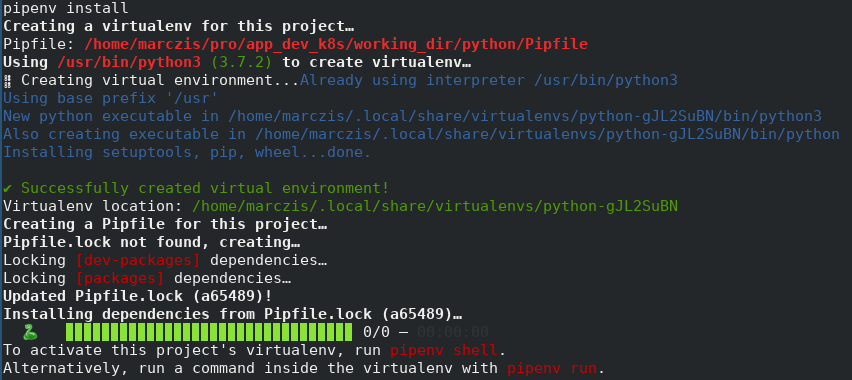
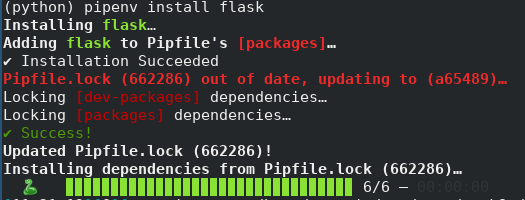

# Chapter 1, Developing a simple REST service
In this chapter you will make a small python code to handle REST API requests, with the famous Flask python module.

## Setup your environment
 - If you don't have it yet, install pipenv tool.

### Create a new python environment
```bash
pipenv install
```

The output shall look something like this:



Enter into the new environment with:

```
pipenv shell

Launching subshell in virtual environment…
 . /home/marczis/.local/share/virtualenvs/python-gJL2SuBN/bin/activate
```

Note: The easiest way to confirm which environment you are "in" is to use: 
```
which python
/home/marczis/.local/share/virtualenvs/python-gJL2SuBN/bin/python
```

### Install python packages
Now we will install the python packages we need for our application

```bash
pipenv install flask
```

The output shall be something like this:



I like to have the "ipython" tool around, so add it as a development package - which means this won't be added to the release version. If you are not familiar with ipython this is a good time to check it out. It is an enhanced python shell - helps a lot to try out things on the fly.

```bash
pipenv install ipython -dev
```

Output:


### Directory structure
I prefer to organize my code into modules, such an easy example create the next structure inside your project directory:

```bash
(python) tree
.
├── app
│   └── app.py
├── Pipfile
└── Pipfile.lock
```

Or if you are super lazy copy paste this into bash:

```bash
mkdir app
echo 'print("hello")' > app/app.py
```

In such a setup you can invoke your app like this:

```bash
(python) python -m app
hello
```

(Assuming that you are outside of the app directory, and you are already inside the python environment)

### The code
The most simples flask example I managed to find:

```python
from flask import Flask
app = Flask(__name__)

@app.route('/')
def hello_world():
    return 'Hello, World!'
```

[Code is from: flask.pocoo.org](http://flask.pocoo.org/docs/1.0/quickstart/)

So modify the app/app.py and then you can test your code locally:

```bash
cd app
flask run
```

Open a new terminal and run curl:

```bash
curl 127.0.0.1:5000
```

You shall see something like this:


