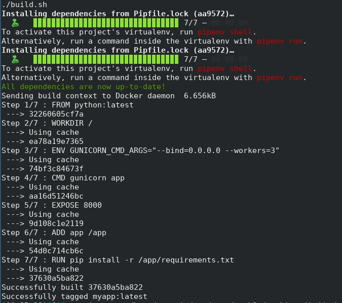
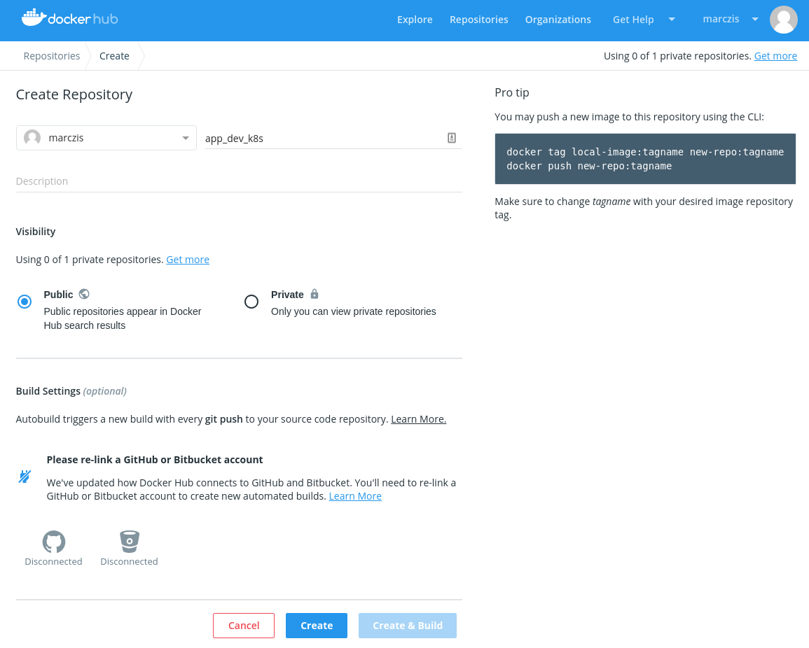
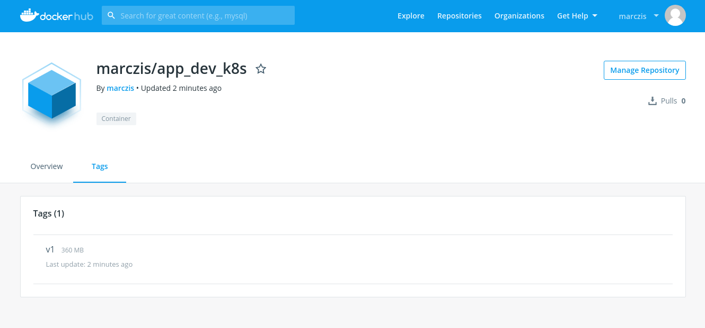

# Chapter 2, Packing your application into a docker image
Now we have a simple application, time to pack it into a container.
(as you see in the repository, I created a separated directory for this in my "working_dir")

Note: this is not necessary the best way to pack your application, but works very well for now.

## Build steps
In this example we will build a docker image from the python offical image, which has python and pip pre-installed. Unfortunately docker can't execute local steps before the image is built, so I wrote a little bash script around the building process:

```bash
#!/bin/bash

BUILD_DIR=${PWD}

cd ../python/
pipenv install
pipenv sync
cp -r app ${BUILD_DIR}/
pipenv lock -r > ${BUILD_DIR}/app/requirements.txt
cd ../docker/
docker build . -t myapp:latest
rm -r app
```

So lets discuss this script in some details. The build steps are the next:
   1. Refresh the python environment
   2. Copy the application into the build directory -> You can't refer to files outside of the building context
   3. Create a requirements.txt from the python environment for pip -> so we can install the dependencies in the container
   4. Return to the build directory and starts the build process, tags the result as myapp:latest
   5. Clean up the temporary files

## Docker file
To build with docker we need a docker file which looks like this for us now:

```docker
FROM python:latest
WORKDIR /
ENV GUNICORN_CMD_ARGS="--bind=0.0.0.0 --workers=3" 
CMD gunicorn app
EXPOSE 8000

ADD app /app
RUN pip install -r /app/requirements.txt
```

Again, lets see what happens here:
   1. We use python:latest -> For production use it is always a good idea to have a governance over the versions, so use FIXED Versions!
   2. We set the WORKDIR to root, which means our container will start up and "stand" in the root instead of a home directory
   3. We use gunicorn as our webserver, so we pass a couple of parameters to it via environment variables
   4. We set the container's execution command to gunicorn app
   5. We expose port 8000 - which is the default for gunicorn
   6. The last two line is for the build time, we add the app directory and we install the dependencies based on the generated requirements.txt file

## Build
So from the ```docker``` directory, run the shell script, if everything works as expected, you shall see something like this:



## Execute
To run the container locally you can use the next command:

```bash
docker run -p 8000:8000 -it myapp
[2019-03-08 10:36:08 +0000] [7] [INFO] Starting gunicorn 19.9.0
[2019-03-08 10:36:08 +0000] [7] [INFO] Listening at: http://0.0.0.0:8000 (7)
[2019-03-08 10:36:08 +0000] [7] [INFO] Using worker: sync
[2019-03-08 10:36:08 +0000] [10] [INFO] Booting worker with pid: 10
[2019-03-08 10:36:08 +0000] [11] [INFO] Booting worker with pid: 11
[2019-03-08 10:36:08 +0000] [12] [INFO] Booting worker with pid: 12
[2019-03-08 10:36:10 +0000] [7] [INFO] Handling signal: winch
[2019-03-08 10:37:17 +0000] [7] [INFO] Handling signal: winch
[2019-03-08 10:37:53 +0000] [7] [INFO] Handling signal: winch
[2019-03-08 10:38:00 +0000] [7] [INFO] Handling signal: winch
[2019-03-08 10:38:28 +0000] [7] [INFO] Handling signal: winch
```

 - -p 8000:8000 -> will map the container's 8000 to the host 8000
 - -it -> will make the session interactive and it will assign a terminal to it, so you can interact with the container - like exit with ^C
 - If you don't define version, docker will pick the "latest" tag, same result would be if you say myapp:latest

 Now open a new terminal and try if the service works:

```bash
curl 127.0.0.1:8000
Hello, World!
```

Perfect, just what we expected. As a practice, now go and add a ```/test``` path to your code.
The expected outcome:

```bash
curl 127.0.0.1:8000/test
Everything works as expected.
```

(hint, you can cheat from the repo if you stuck.)

For extra "point" - think a bit about the code, how could you return JSON? 

(hint, search json.dumps)

Again, more things to consider, how to return HTTP error codes? Do some research on Flask, it can do amazing things.

## Sharing your image
So now we packed the application into a docker container, to be able to deploy it on K8s, we have to add it to a container registry, this can be private or public registry, we will use now docker hub - just to make life easy.

### Prepare
if you don't have one, go and create an account on hub.docker.com

### Create a new repository


See the pro tip on the side? Easy like that

### Login to docker, from the CLI
To use the new repository you have to login from the command line:

```bash
docker login
Login with your Docker ID to push and pull images from Docker Hub. If you don't have a Docker ID, head over to https://hub.docker.com to create one.
Username: marczis
Password: 
WARNING! Your password will be stored unencrypted in /home/marczis/.docker/config.json.
Configure a credential helper to remove this warning. See
https://docs.docker.com/engine/reference/commandline/login/#credentials-store

Login Succeeded
```

Read the warning - and learn about the credentials-store to be safe!

### Sharing your image

Let's try to push our image:

```bash
docker push marczis/app_dev_k8s:latest
The push refers to repository [docker.io/marczis/app_dev_k8s]
An image does not exist locally with the tag: marczis/app_dev_k8s
```

As you can see, we don't have the give tag locally - we have many options to solve it, but lets go and fix your build script, so it will generate the right tags.

For now, lets create a first version from he last built image:

```bash
docker tag myapp:latest marczis/app_dev_k8s:v1
```

and now we can try to push again:

```bash
docker push marczis/app_dev_k8s:v1
The push refers to repository [docker.io/marczis/app_dev_k8s]
7e015a91bb5d: Pushed 
d26e343d34a5: Pushed 
bb839e9783c7: Pushed 
237ce60325c6: Mounted from library/python 
1b976700da1f: Mounted from library/python 
bde41e1d0643: Pushed 
7de462056991: Mounted from library/python 
3443d6cf0f1f: Pushed 
f3a38968d075: Mounted from library/python 
a327787b3c73: Mounted from library/python 
5bb0785f2eee: Mounted from library/python 
v1: digest: sha256:a28f4cc858426e9817ce2fb4031f96420f4a37eef5eb59302670ac95006074af size: 2636
```

Much better!

If you switch back to docker hub, you will see your new version in the tags:


It is always a nice thing to create a latest tag, which points to your latest version, go ahead a create one!
(hint, tag & push)

Now we are ready to deploy on K8s!

[Proceed to Chapter 3](../Chapter-3/Chapter3.md)