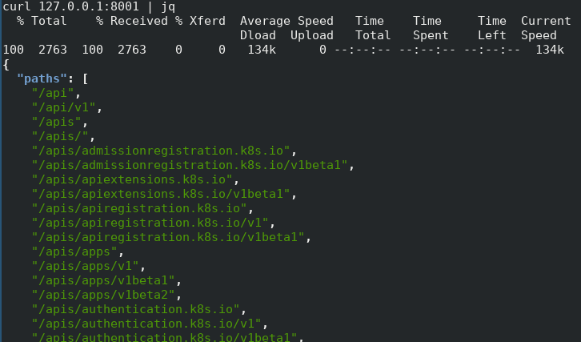

# Deploy your application to K8s
As for now, I don't describe how to setup your K8s cluster. It is very simple and staright forward, at least for this exercise, you have so many options:
 - Google Cloud Platform - create a Kubernetes cluster and use the gcloud tool to install and setup kubectl
 - Amazon Web Services - create an EKS cluster
 - minikube - deploy a local kubernets installation on the top of Virtualbox

All of above works well, and should be good enough for this exercise, I picked GCP as I was learning about that at the time being.

So from here on, I assume you have a working cluster somewhere and your kubectl is setup. - again as time let me do I will setup some exercise about this part too. - if you volunteer, please feel free to fork, do the steps and make a pull request!

## Create a deployment
kubectl can pull images from multiple sources, docker hub is one of them by default. Just to keep the exercise simple we used a public repository - again not working for your company business secrets. Do a little research on private repositories and how to authenticate to them from kubectl.

```bash
kubectl run myapp --image=marczis/app_dev_k8s:v1 --port=8000
deployment.apps/myapp created
```

Now many thing can go wrong at this step, your cluster may fail to pull the images, and so on and so on.
To investigate these issues you may want to try these steps - and for now just to confirm that our app is running.

```bash
kubectl get deployment 
NAME      DESIRED   CURRENT   UP-TO-DATE   AVAILABLE   AGE
myapp     1         1         1            1           2m
```

Available here shall be 1 for now, means that we asked for one container and it runs (as a pod) on a node.

Lets check the pod itself:

```bash
kubectl get pod
NAME                    READY     STATUS    RESTARTS   AGE
myapp-7cb59ddcb-klk7v   1/1       Running   0          3m
```

Nice, it is running. Lets see the logs

```bash
kubectl logs myapp-7cb59ddcb-klk7v
[2019-03-08 11:33:08 +0000] [6] [INFO] Starting gunicorn 19.9.0
[2019-03-08 11:33:08 +0000] [6] [INFO] Listening at: http://0.0.0.0:8000 (6)
[2019-03-08 11:33:08 +0000] [6] [INFO] Using worker: sync
[2019-03-08 11:33:08 +0000] [9] [INFO] Booting worker with pid: 9
[2019-03-08 11:33:08 +0000] [10] [INFO] Booting worker with pid: 10
[2019-03-08 11:33:08 +0000] [11] [INFO] Booting worker with pid: 11
```

A M A Z I N G

But what now? We still can't reach our application, can we? As a first step lets test a bit the kubectl proxy.
This is a very very good tool for developers, in one terminal run the next command:

```bash
kubectl proxy
Starting to serve on 127.0.0.1:8001
```

In an other terminal lets see what this proxy can do for us:

```bash
curl 127.0.0.1:8001 | jq
```

If you never heard about the "jq" tool, it is time to do your search, and install it. It will make life much easier when you work with JSON.

The output should be something like this:



So many things it can do for us, I won't really go into details, but lets see why it is important for us now, try the next command:

```bash
curl http://localhost:8001/api/v1/namespaces/default/pods/myapp-7cb59ddcb-klk7v/proxy/
Hello, World!
```
Very very nice, we were able to reach our service - without exposing anything to the world yet, over this built in proxy feature!

NOTE: hopefully you realized that the POD name is different for your, and you have to change that in every command.

Again, lets say you have some issues and want to investigate the internal life of your container, kube provides a nice feature, you can actually login and execute commands on your running container (ofc this comes from docker, but kube exposes this feature)

Try the next command:

```bash
kubectl exec -it myapp-7cb59ddcb-klk7v /bin/bash
root@myapp-7cb59ddcb-klk7v:/#
root@myapp-7cb59ddcb-klk7v:/# ps ax
    PID TTY      STAT   TIME COMMAND
      1 ?        Ss     0:00 /bin/sh -c gunicorn app
      6 ?        S      0:01 /usr/local/bin/python /usr/local/bin/gunicorn app
      9 ?        S      0:00 /usr/local/bin/python /usr/local/bin/gunicorn app
     10 ?        S      0:00 /usr/local/bin/python /usr/local/bin/gunicorn app
     11 ?        S      0:00 /usr/local/bin/python /usr/local/bin/gunicorn app
     12 ?        Ss     0:00 /bin/bash
     17 ?        R+     0:00 ps ax

```

Very nice.

## Expose your application
So everything is nice and shinny, our application runs and we are happy, what's next? We have to "expose" it to the external world, so our users can reach it. 
Again, many many options, but keep it easy for now, lets go by a Load balancer.

```bash
kubectl expose deployment myapp --type=LoadBalancer --name=myapplbs
service/myapplbs exposed
```

This command will create the loadbalancer for us, and a service and will assign an external IP.

Lets check the status with:

```bash
kubectl get service
kubectl get service
NAME         TYPE           CLUSTER-IP     EXTERNAL-IP     PORT(S)          AGE
kubernetes   ClusterIP      10.207.0.1     <none>          443/TCP          2d
myapplbs     LoadBalancer   10.207.1.203   <pending>       8000:31137/TCP   7s
```

Still pending good. Wait for a bit.

```bash
kubectl get service
NAME         TYPE           CLUSTER-IP     EXTERNAL-IP     PORT(S)          AGE
kubernetes   ClusterIP      10.207.0.1     <none>          443/TCP          2d
myapplbs     LoadBalancer   10.207.1.203   34.76.152.171   8000:31137/TCP   1m
```

There we go, we have a new loadbalancer with an external IP, lets try it out:

```bash
curl 34.76.152.171:8000
Hello, World!
```

Great! It works as expected.

## Scale up / down
Now the real power of k8s as I see, lets say our REST API become super super famous and gets a lots of requests, time to scale vertiaclly, (ofcourse in real life this would not be good enough to scale manually, but for now play along)

```bash
kubectl scale deployment/myapp --replicas=4
deployment.extensions/myapp scaled

kubectl get pods
NAME                    READY     STATUS              RESTARTS   AGE
myapp-7cb59ddcb-6jz6r   0/1       ContainerCreating   0          5s
myapp-7cb59ddcb-k4qfk   1/1       Running             0          5s
myapp-7cb59ddcb-klk7v   1/1       Running             0          1h
myapp-7cb59ddcb-xkgs6   1/1       Running             0          5s
```

Easy huh ? I think you can figure out the scale down procedure. One interesting fact here, scaling to 0 pods is totally acceptable thing.

Now, we have an issue, we can still ask requests from our application, and one of the pods will handle our request, but we have no way to see which one is handling our request. We will solve this issue by creating a new version of our code - in Chapter 4

[Proceed to Chapter 4](../Chapter-4/Chapter4.md)